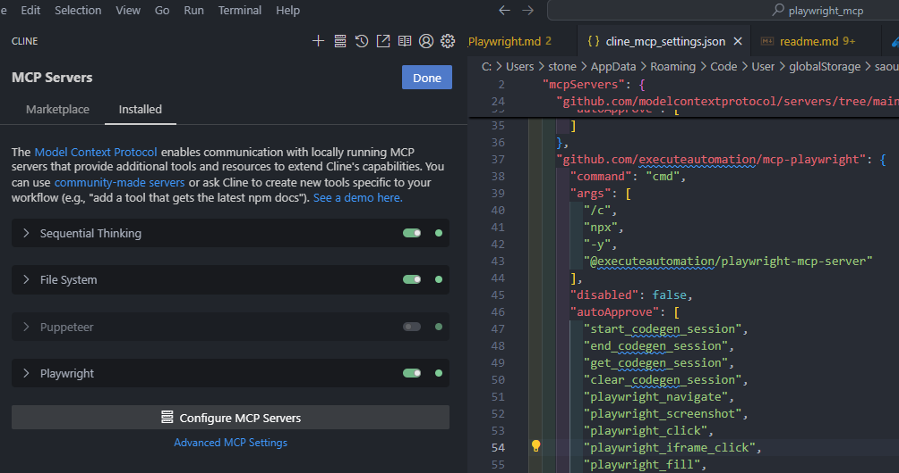
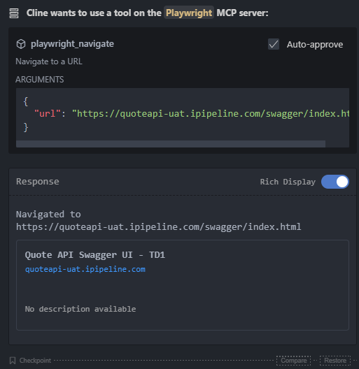
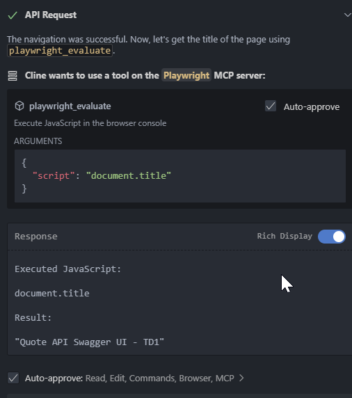
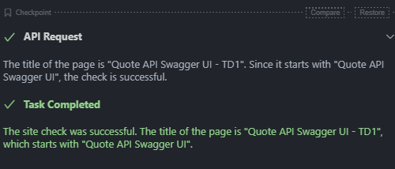

# MCP with PlayWright test

## Project Summary

This project demonstrates the integration of Playwright with MCP (Micro Code Protocol) to automate web interactions and validations. It provides a step-by-step guide to set up Playwright, configure MCP for automation tasks, and test the setup with a sample use case. The example showcases how to navigate to a webpage, extract the title, and validate its content programmatically using Playwright commands.

## 1. Install Playwright

Reference <https://playwright.dev/docs/intro>

```shell
npm init playwright@latest
```

[install logs](install_Playwright.md)

## 2. Install Playwright MCP 

Use Cline or RooCode to install Playwright MCP.

Below is the my MCP config file for Windows 11.

```json
"github.com/executeautomation/mcp-playwright": {
      "command": "cmd",
      "args": [
        "/c",
        "npx",
        "-y",
        "@executeautomation/playwright-mcp-server"
      ],
      "disabled": false,
      "autoApprove": [
        "start_codegen_session",
        "end_codegen_session",
        "get_codegen_session",
        "clear_codegen_session",
        "playwright_navigate",
        "playwright_screenshot",
        "playwright_click",
        "playwright_iframe_click",
        "playwright_fill",
        "playwright_select",
        "playwright_hover",
        "playwright_evaluate",
        "playwright_console_logs",
        "playwright_close",
        "playwright_get",
        "playwright_post",
        "playwright_put",
        "playwright_patch",
        "playwright_expect_response",
        "playwright_assert_response",
        "playwright_custom_user_agent",
        "playwright_get_visible_text",
        "playwright_get_visible_html",
        "playwright_go_back",
        "playwright_go_forward",
        "playwright_drag",
        "playwright_press_key",
        "playwright_save_as_pdf"
      ]
    }
```
- Cline MCP server config


## 3 Test mcp-playwright

User input:
```text
use playwright, 
visit `https://quoteapi-uat.ipipeline.com/swagger/index.html `, get value of the <title>, 
if the title value start with `Quote API Swagger UI `, 
its success, otherwise, its failed. 
please show me the status if the site is success or failed.
```

AI Response:

- API Request

    ```text

    The task is to use Playwright to visit a URL, get the value of the <title> tag, and determine if the title starts with "Quote API Swagger UI". Based on this, report whether the site check was a success or failure.

    Here's the plan:

    Use the playwright_navigate tool to visit the specified URL.
    Use the playwright_evaluate tool to get the title of the page.
    Evaluate the title to determine if it starts with "Quote API Swagger UI".
    Use the attempt_completion tool to report the status (success or failed).
    Now, let's start by navigating to the URL.
    ```
- playwright_navigate
    - 

- playwright_evaluate    
    - 

- attempt_completion
    - 