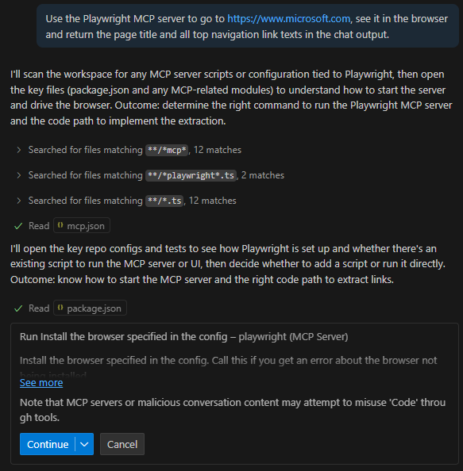

# MCP with PlayWright test

Blog post and video on why MCP + Playwright:
https://nearform.com/digital-community/supercharging-playwright-testing/

## Project Summary

This project demonstrates the integration of Playwright with MCP and usage from VS Code GHCP.

## 1. Install Playwright

Follow this: https://playwright.dev/docs/intro

However, for VS Code, I installed it by installing the Playwright VS Code extension:
https://playwright.dev/docs/getting-started-vscode


##**Note:**

**The Playwrigth MCP server is for agent-driven browser automation, not running Playwright Test specs. Use the Playwright CLI or Playwright VS Code extension for running the tests.**

For instance, for running a test you can do it with the CLI like the following:

```
npx playwright test e2e/microsoft-site-tests.spec.ts --project='Microsoft Edge' --reporter=line
```


Or with the GH Extension pressing the button:


Or running the Test in Playwright UI Mode:
```
npx playwright test e2e/quote-api-swagger-ui-check.spec.ts --ui --project='Microsoft Edge' --ui-host=127.0.0.1 --ui-port=9323
```


## 2. Install Playwright MCP server

Add the following MCP config file to your the .vscode/mcp.json file.

```json
{
  "servers": {
    "playwright": {
      "command": "npx",
      "args": [
        "@playwright/mcp@latest",
        "--browser=msedge"
      ]
    }
  }
}
```


## 3 Test mcp-playwrightw with example prompts:

User input:
```text
Playwright: go to https://www.microsoft.com and return the page then create a screenshot of it and put it in the screenshots folder with the name microsoft-home-page-screenshot-by-playwright-mcp-server.png
```

```text
Use the Playwright MCP server to go to https://www.microsoft.com, see it in the browser and return the page title and all top navigation link texts in the chat output.
```





